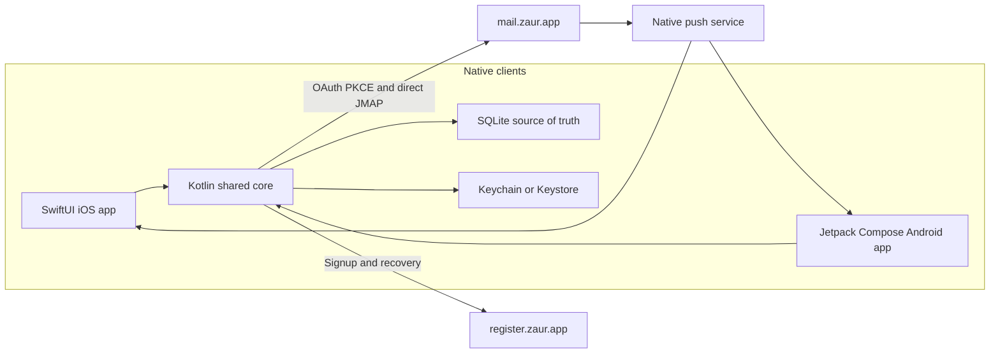
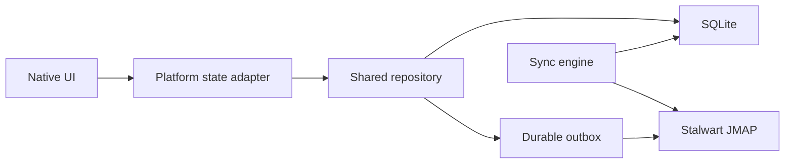

# ZAUR Mail native clients

**Current direction ([ADR-0002](decisions/0002-capacitor-shell.md)):** `apps/mobile` is a
Capacitor shell that loads the live webmail. Build the Android debug APK with
`pnpm --filter @zaur/mobile build:android` (needs the Android SDK and a JDK); install via
`adb install apps/mobile/android/app/build/outputs/apk/debug/app-debug.apk`.

The rest of this document is the superseded
[ADR-0001](decisions/0001-native-mobile-architecture.md) Kotlin Multiplatform plan, kept as the
upgrade path if the shell proves inadequate. The [Native push gap](#native-push-gap) section
applies to both approaches.

## Goals

- Deliver iOS and Android together without compromising platform-native interaction and
  accessibility.
- Keep mail, authentication, synchronization, and offline behavior consistent across platforms.
- Make the inbox, reader, search, and compose useful with unreliable or absent connectivity.
- Integrate with native secure storage, sharing, files, background work, and notifications.
- Keep the web/PWA client supported and independently deployable.

## Planned layout

```text
apps/mobile/
  shared/
    src/commonMain/       JMAP, OAuth, models, repositories, sync, SQLDelight
    src/androidMain/      Android storage, scheduling, and network adapters
    src/iosMain/          Apple storage, scheduling, and network adapters
    src/commonTest/       Protocol fixtures and repository tests
  androidApp/             Jetpack Compose UI and Android integrations
  iosApp/                 SwiftUI UI and Apple integrations
```

`shared` must not depend on Compose Multiplatform UI. Its public API should expose stable domain
models, repository operations, and observable data streams. Presentation state remains in native
platform code.

## Runtime architecture



## Authentication

Native clients authenticate directly with Stalwart; they do not create a webmail cookie session.

1. Discover the authorization and token endpoints from
   `https://mail.zaur.app/.well-known/oauth-authorization-server`.
2. Use Authorization Code with PKCE S256 and a dedicated public client registration for each
   native application.
3. Request `offline_access` plus mail, contacts, and calendars scopes.
4. Store refresh tokens behind a platform interface implemented with Keychain on iOS and
   Keystore-backed storage on Android.
5. Refresh before expiry and serialize refresh operations per account.
6. Treat invalid refresh grants as an account-scoped sign-out, never as a global sign-out.

The web implementation in `apps/webmail/src/lib/server/oauth-*` and
`apps/webmail/src/lib/server/stalwart-auth-*` is a contract reference only. Native clients must not
call webmail's `/api/auth/*` routes or store `SESSION_SECRET`.

## JMAP

The shared core discovers the session document from `https://mail.zaur.app/.well-known/jmap` and
uses URLs returned by the server rather than constructing `/jmap`, upload, download, or event URLs.

Initial protocol scope:

- mailbox list and state changes;
- email query, get, changes, set, and thread expansion;
- draft creation and updates;
- submission and attachment upload/download;
- server-side search;
- quota and vacation response;
- contacts and calendars after the mail foundation is stable;
- Stalwart account-security methods after core mail flows ship.

Useful behavioral references in webmail:

- `apps/webmail/src/lib/jmap/client.ts`
- `apps/webmail/src/lib/jmap/types.ts`
- `apps/webmail/src/lib/jmap/map.ts`
- `apps/webmail/src/lib/jmap/email-build.ts`
- `apps/webmail/src/lib/sync/engine.ts`
- `apps/webmail/src/lib/sync/outbox-processor.ts`

Port behavior and test fixtures, not browser or SvelteKit implementation details.

## Offline-first data flow

The local SQLite database is the source of truth read by both native UIs. SQLDelight provides the
shared schema and typed queries; repositories coordinate local and remote data sources.



- Reads always come from SQLite-backed observable queries.
- Network responses update SQLite transactionally before the UI observes them.
- JMAP state tokens are stored per account and data type.
- Writes enter a durable outbox before transmission and expose pending/failed state to the UI.
- Reconnect, foreground, push, and scheduled work all invoke the same idempotent sync coordinator.
- Database files and queued work are isolated per account.

## Platform-owned behavior

The shared core defines interfaces but does not hide platform capabilities:

- SwiftUI and Compose navigation, layout, animation, accessibility, and adaptive presentation;
- Keychain and Keystore-backed token storage;
- BGTaskScheduler and WorkManager;
- APNs and FCM registration;
- native share sheets, file pickers, downloads, and attachment previews;
- notification actions, deep links, widgets, and app shortcuts;
- platform lifecycle and network reachability.

## Registration and recovery

Public flows call `https://register.zaur.app` directly:

- `GET /api/config`
- `GET /api/domains`
- `GET /api/captcha`
- `POST /api/check-username`
- `POST /api/register`
- password-reset request, verification, and reset endpoints

Server-to-server endpoints protected by `REGISTER_INTERNAL_SECRET` or `WEBMAIL_INTERNAL_SECRET`
must never be called or receive secrets from a mobile client. Recovery verification links should
eventually support universal/app links with a safe web fallback.

## Native push gap

**Implemented (2026-07-11):** native push reuses webmail's existing pipeline — the Stalwart
watcher (`push-watcher.ts`) is delivery-agnostic; subscription records now carry either a Web Push
subscription or an FCM device token, and `push-sender.ts` branches per platform. FCM delivery is
`fcm.ts` (HTTP v1 with a service-account JWT, no firebase-admin dependency). The Capacitor shell
registers via `@capacitor/push-notifications`; `notifications.ts` detects the native bridge and
posts `{ fcmToken }` to the same `/api/push/subscribe` / `unsubscribe` endpoints. Notification
taps navigate via the `data.url` payload (`initNativePushNavigation`). FCM also delivers to iOS
(via APNs) when the iOS shell lands, so one sender covers both platforms.

Remaining setup (owner action, one-time):

1. ~~Create a Firebase project and register Android app `app.zaur.mail`.~~ Done — project
   `zaur-mail`.
2. ~~Drop `google-services.json` into `apps/mobile/android/app/`.~~ Done — committed.
3. Create a service account with the "Firebase Cloud Messaging API" role, download its JSON key,
   and set it as the `FCM_SERVICE_ACCOUNT` env var (the raw JSON) on the webmail service.
   Until this is set, `/api/push/vapid-public-key` reports `fcm: false` and the shell's
   subscribe attempt gets `server_disabled`.

## Release readiness (audited 2026-07-11)

Shell-side gaps closed in-repo: `allowNavigation: ['register.zaur.app']` (signup stays
in-WebView; login never leaves webmail.zaur.app), `POST_NOTIFICATIONS` manifest permission
(Android 13+), release signing wired via gitignored `android/keystore.properties`,
`build:android:release` script (`bundleRelease`).

Remaining owner actions before store submission:

1. **`FCM_SERVICE_ACCOUNT`** on the webmail service (step 3 above) — native push is dead
   without it.
2. **Release keystore** — generate once (`keytool -genkeypair -v -keystore zaur-mail.jks
   -alias zaur-mail -keyalg RSA -keysize 4096 -validity 10000`), fill
   `android/keystore.properties` (`storeFile`/`storePassword`/`keyAlias`/`keyPassword`),
   back it up off-repo. Play listing, data-safety form, privacy policy URL follow.
3. **iOS project** — greenfield: needs a Mac (`cap add ios`), APNs key uploaded to the
   `zaur-mail` Firebase project, `WKAppBoundDomains` = webmail.zaur.app + register.zaur.app
   in Info.plist (required by `limitsNavigationsToAppBoundDomains: true`), Apple developer
   account. Watch App Store guideline 4.2 (thin remote-URL clients) — ADR-0001 KMP is the
   documented fallback.
4. **App Links (deferred)** — recovery/verification links opening in the app need an
   `autoVerify` intent filter plus `/.well-known/assetlinks.json` on webmail.zaur.app with
   the release-cert SHA-256; blocked on the keystore existing first.
5. **CI (deferred)** — builds are manual (`pnpm --filter @zaur/mobile build:android[:release]`);
   add a workflow when releases become frequent.

Notifications carry sender + subject only — never message bodies. Token rotation is handled by
re-registration on every app start; revocation by unsubscribe and by pruning on FCM 404
(UNREGISTERED). Foreground synchronization does not depend on native push.

## Milestones

### 1. Foundation spike

- Create the KMP shared module and empty native shells.
- Register native OAuth clients and redirects.
- Prove sign-in, TOTP challenge, refresh, sign-out, JMAP discovery, and inbox fetch.
- Verify the shared API is natural to consume from Swift and Kotlin.
- Decide the minimum supported iOS and Android versions from measured API requirements.

### 2. Offline mail core

- Add SQLDelight schema, repositories, change-state sync, and durable outbox.
- Implement mailbox list, inbox, reader, compose, attachments, search, and optimistic actions.
- Share protocol fixtures with the TypeScript client and test against a dedicated Stalwart account.

### 3. Native product quality

- Add platform navigation, accessibility, dynamic type/font scaling, theming, sharing, files, and
  background synchronization.
- Add contacts, calendars, account security, multi-account isolation, and recovery deep links.

### 4. Distribution

- Add APNs/FCM delivery and notification actions.
- Add crash reporting with mail-content redaction.
- Configure signing, privacy manifests, store metadata, TestFlight, and Play testing tracks.

## Non-goals

- Replacing or embedding the SvelteKit webmail.
- Sharing SwiftUI/Compose screen implementations.
- Calling webmail's cookie-authenticated `/api/*` routes.
- Reusing RxDB, Dexie, IndexedDB, service workers, or Web Push.
- Reaching feature parity before validating the mail foundation and native interaction quality.
